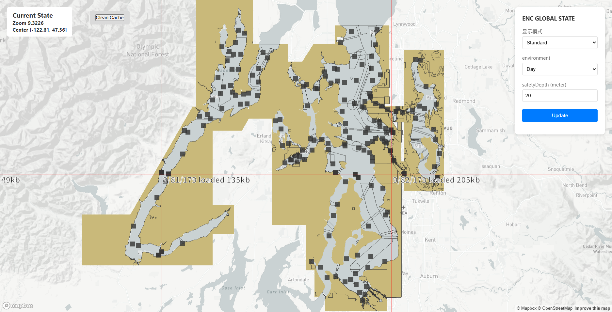
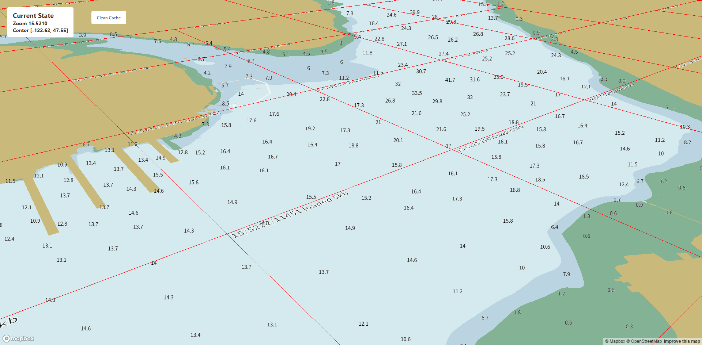
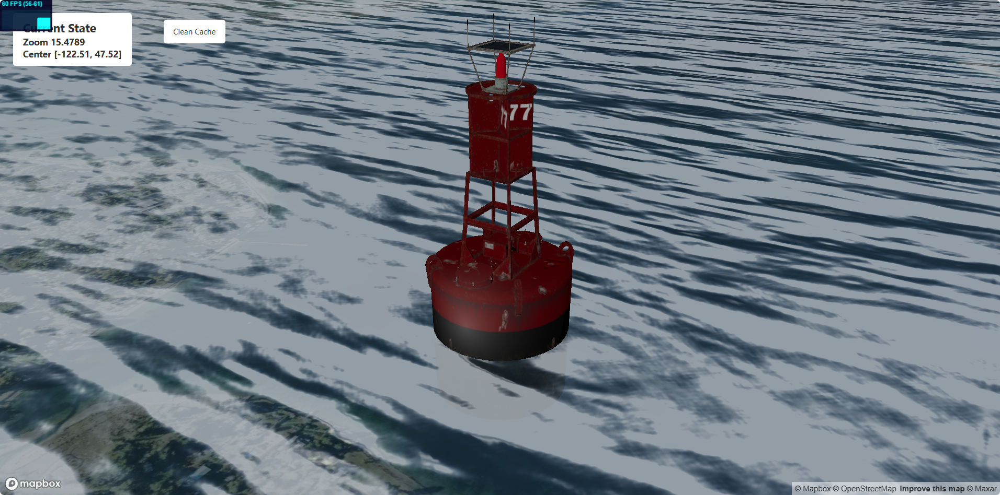
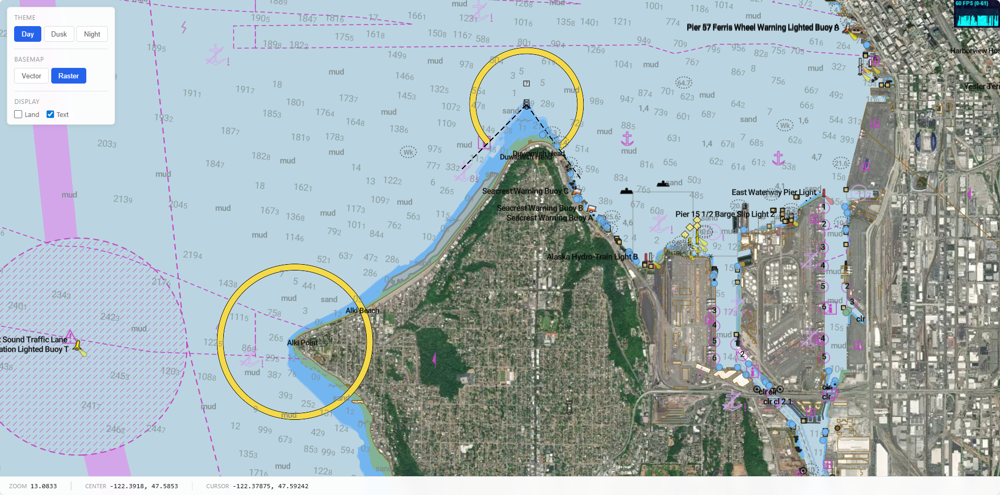

# mapbox-gl-enc-runtime

Mapbox-gl Electronic Navigational Chart Runtime

## Framework

```
+---------------------+
|       MapboxGL      |      ← Camera、Interaction、gl
+---------+-----------+
          |
     Custom Layer
          |
+---------v--------------+
|      ENC Runtime       |   ← Core
|  - Tile Manager        |
|  - S52 LUP & CSP       |
|  - Feature Interpreter |
|  - Context Manager     |
+---------+--------------+
          |
     MBTiles Source
```

## Development Log

### Try to build custom vector tile renderer with mapbox-gl



- Basic vector polygon render
- Basic vector line render
- Basic vector point render

I try to aggregate the features in the vector tile, process them with a series of redundant conditions, and then render them to the screen. I didn't implement any optimization, but it can work normally.

### Try to implement the SOUNDG layer



- Screen Collision Detection Based on Grid Index
- Build Text Atlas with TinySDF
- Text Rendering with Perspective Projection

It has taken a long time, yet the result is not good, especially for the features at the viewport edges.

### Small practice about 3D ENC



- Basic Water Wave Render (data from DEPARE)
- Basic GLTF Render (data from beacon, buoy, trawler)
- A Local Coordinate System to avoid map jitter when zooming over level 16.

This is a small practice about 3D ENC, I just want to test if the depth is correct in Mapbox's world

### Humans differ from animals in tool use.



- S57 parse and compress to mvt
- 300+ S52 layers with mapbox expressions
- LIGHTS layer with customLayerInterface
